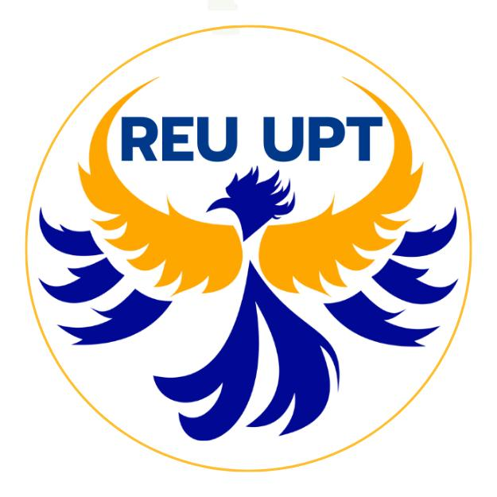

# 🎱 Bingo — Tablero de Proyección

Tablero de proyección web para bingo B-I-N-G-O de 75 números. Configurable, modular y open source.

Ideal para actividades universitarias, eventos sociales, rifas y cualquier ocasión donde necesites un bingo proyectable.



---

## ✨ Características

- ✅ Tablero B-I-N-G-O del 1 al 75
- ✅ Marcar y desmarcar números con un clic
- ✅ Último número cantado destacado
- ✅ Historial de últimos números en burbujas
- ✅ Contador de números salidos
- ✅ Reiniciar partida con confirmación
- ✅ Persistencia del estado en localStorage
- ✅ Diseño responsivo y moderno
- ✅ Fácilmente personalizable (logo, colores, textos)
- ✅ Sin dependencias — solo HTML, CSS y JavaScript

---

## 🚀 Inicio Rápido

### Opción 1: Servidor local (recomendado)

```bash
# Clonar el repositorio
git clone https://github.com/tu-usuario/bingo.git
cd bingo

# Levantar un servidor local (cualquiera de estos)
npx serve .
# o
python -m http.server 3000
# o usar Live Server en VS Code
```

Luego abre `http://localhost:3000` en tu navegador.

### Opción 2: GitHub Pages

1. Sube el proyecto a un repositorio de GitHub
2. Ve a **Settings → Pages → Source: main branch**
3. Tu bingo estará disponible en `https://tu-usuario.github.io/bingo/`

> **Nota**: Este proyecto usa ES Modules (`import`/`export`), por lo que necesita servirse desde un servidor HTTP. No funciona abriendo `index.html` directamente como archivo (`file://`) debido a restricciones CORS del navegador.

---

## 🎨 Personalización

Toda la configuración del evento está en un solo archivo: **[`src/config.js`](src/config.js)**

### Cambiar branding

```js
export const CONFIG = {
  appName: "BINGO",                          // Nombre de la app
  organization: "Tu Organización",           // Nombre de tu grupo/empresa
  subtitle: "Tu Universidad / Evento",       // Subtítulo
  kicker: "Departamento o Eslogan",          // Texto superior pequeño
  logoPath: "./assets/logo.jpeg",            // Ruta al logo
  logoAlt: "Logo de mi organización",        // Texto alternativo del logo
  // ...
};
```

### Cambiar colores

```js
theme: {
  primary: "#00106f",       // Color principal (fondo oscuro)
  primaryLight: "#003f90",  // Variante clara
  primaryMid: "#0759b8",    // Variante media
  accent: "#ffb20d",        // Color de acento (números marcados)
  accentSoft: "#ffd466",    // Acento suave (textos destacados)
  background: "#050916",    // Fondo general
  text: "#f9fbff",          // Color de texto principal
  muted: "#b9c7ea",         // Texto secundario
},
```

### Cambiar logo

Reemplaza el archivo `assets/logo.jpeg` con tu logo y actualiza `logoPath` en config si usas otro nombre o formato.

### Activar/desactivar funciones

```js
enableAnimations: true,     // Animaciones de sweep al cantar número
enableLocalStorage: true,   // Guardar estado entre recargas
```

---

## 📁 Estructura del Proyecto

```
bingo/
├── index.html              ← Punto de entrada HTML
├── styles/
│   └── main.css            ← Estilos (variables CSS dinámicas)
├── src/
│   ├── config.js           ← ⚙️ Configuración personalizable
│   ├── main.js             ← Punto de entrada JS, inicialización
│   ├── board.js            ← Generación del tablero B-I-N-G-O
│   ├── state.js            ← Estado de la partida (números, toggle)
│   ├── storage.js          ← Persistencia en localStorage
│   ├── ui.js               ← Actualización del DOM (callout, burbujas)
│   └── modes.js            ← Placeholder: modos de victoria (v0.3+)
├── assets/
│   └── logo.jpeg           ← Logo del evento
├── README.md
├── LICENSE
└── .gitignore
```

---

## 🗺️ Roadmap

| Versión | Descripción | Estado |
|---------|-------------|--------|
| v0.1 | HTML monolítico original | ✅ Completado |
| v0.2 | Reestructuración modular + configuración | ✅ Completado |
| v0.3 | Menú principal + selector de modo | ✅ Completado |
| **v0.4** | **Registro de ganadores + historial del día** | ✅ **Actual** |
| v0.5 | Sorteo automático + deshacer último | 📋 Planeado |
| v0.6 | Generación de cartillas | 📋 Planeado |
| v0.7 | Validación automática de ganador | 📋 Planeado |
| v1.0 | Release estable con todas las features core | 📋 Planeado |

---

## 🤝 Contribuir

¡Las contribuciones son bienvenidas! Si quieres mejorar el proyecto:

1. Haz un fork del repositorio
2. Crea una rama para tu feature (`git checkout -b feature/mi-mejora`)
3. Haz commit de tus cambios (`git commit -m 'feat: agregar mi mejora'`)
4. Haz push a la rama (`git push origin feature/mi-mejora`)
5. Abre un Pull Request

### Convenciones

- Usa nombres de variables descriptivos en español o inglés
- Mantén los módulos enfocados en una sola responsabilidad
- Comenta solo lo que no sea obvio del código

---

## 📄 Licencia

Este proyecto está bajo la licencia [MIT](LICENSE).

Puedes usarlo, modificarlo y distribuirlo libremente para tus propios eventos. 🎉
